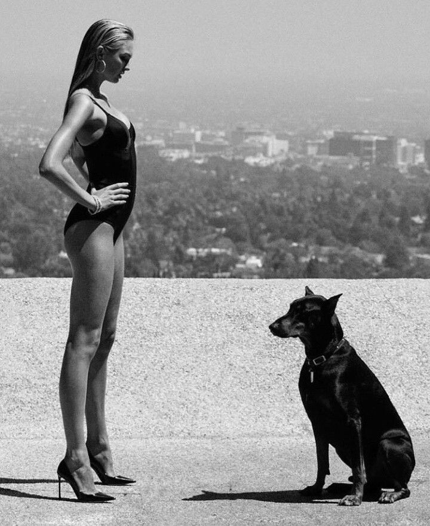

* Композиция в фотографии, это то, о чем слышали все, но детали мало кому известны. В публичном фотографическом дискурсе тема «композиция в фотографии» почти отсутствует, в отличие от обсуждения «железа». Понятно, что темы, связанные с оборудованием, поддерживают производители, заинтересованные в продвижении своей продукции. Представьте, если бы в эпоху ренессанса, существовали бы коммуникации, подобные современным… Наверное художники обсуждали бы качество кистей и красок… *

Композиция сложная и многогранная сущность, а обсуждение технических достоинств камер не требует напряжения и глубоких знаний. Но каким бы резким не было изображение, без идеи и формы, предмета для обсуждения фотографии нет.

В большинстве доступных в сети материалах, обсуждают простейшие правила построения фотографии, польза от которых невелика. Изучение серьезных работ Л.Дыко, А.Лапина, А.Верховского требует концентрации, а читать Р.Арнхейма, без подготовки ─ просто невозможно. Возможно лень способствует техническому прогрессу, но боюсь, для творчества этот закон не работает.

В статье, сделана попытка максимально просто изложить сложные зависимости. Надеюсь, это получилось и, после прочтения, у читателя проснется интерес к теме, возможно.

Композиция в фотографии рождается, когда сходятся все звезды: интересный сюжет, точно выбранный момент, удачный ракурс, красивое освещение и продуманное кадрирование... ну или хотя бы, несколько из перечисленных факторов.  
Используя эти ингредиенты, можно приготовить вкусное блюдо… или нет. В любом случае, все это ─ следствие процесса, который называется «построение кадра». Происходит этот процесс в голове фотографа… поговорим об этом.

Итак, фотография рождается в результате умственных усилий фотографа. Его опыт, художественный вкус и профессиональные навыки способстыуют созданию фотографии. Какое место принадлежит фотокамере? Вторичное ─ совершенная камера и качественная оптика упрощают задачу и дают больше своботы, но не более того.

Фотография может возникнуть и случайно… Так бывает, но чтобы понять, что звезды сошлись, нужен опыт, знания, вкус и насмотренность, которая тоже составляет часть опыта. Иначе жемчужина навсегда потеряется в грудах мусора. Круг замкнулся, чтобы создать гармонию и чтобы ее увидеть, требуется одно и тоже.

Можно ли быстро научиться делать интересные фотографии? Например, с помощью пошаговой инструкции? Не все сводится к простым правилам. Чтобы сделать приличный снимок, требуется больше, чем исполнение пошаговых инструкций из списка, найденного в сети…

Эта статья ─ попытка развеять туман заблуждений и пробудить интерес к вопросам композиции и построения кадра. Не стоит рассчитывать, что после прочтения, можно немедленно приступать к созданию нетленных произведений. Хотя, попытки это делать, принесут большую пользу и некоторый начальный опыт.

Пора начинать, но, зная, что тема, которую я собираюсь обсудить, совсем не бестселлер, начну с дисклеймера…

*Предполагаю, что текст может показаться скучным. Это будет означать, что вопрос профессионального роста пока не стоит остро. Возможно, еще тлеет надежда найти легкий и незатратный путь к мастерству. Когда нет настроя на серьезную работу, нет смысла тратить время на чтение длинного текста.*

Повремените, еще поснимайте, прислушайтесь к своим ощущениям. Человек с творческим складом и жаждой успеха, рано или поздно придет к правильным выводам.

С другой стороны, лучше не затягивать ─ жизнь скоротечна и времени у нас не так много, как хотелось бы.

Теперь, когда я достаточно настроил против себя аудиторию, можно начинать!

## Начинаю

Недавно в одной соцсети появился пост, его автор предложил определить, какая из двух фотографий сделана «топовым» фотографом, а какая "новичком". Уточнялось, что прайс этих фотографов, отличается на порядок. На пост откликнулось несколько человек, которые уверенно пришли к выводу, что работы мало отличаются по уровню. Соответственно, определить какая из фотографий может стоить в десять раз дороже, невозможно.

Заказывая услугу у «дорогого» фотографа, люди, часто получают не только и не столько высокое эстетическое и техническое качество фотографий ─ возможны разные варианты. Они приобретают целый пакет психологических бонусов: ощущение собственной состоятельности и успеха, принадлежность к определенному социальному классу, иллюзию обладания эксклюзивом, надежду на приобщение к миру искусства и много чего еще. Конкретные ощущения зависят от человека и его обстоятельств.

В этом нет ничего плохого, так выглядят «плюшки», которые жизнь дарит успешным людям. Другой вопрос, действительно ли полученные фотографии оригинальны и выполнены на высоком уровне? Ответить на эти вопросы можно в том случае, если есть знания, чтобы объективно оценить качество фотографий.

Противоположный взгляд: зачем платить больше, если разница не всегда и не всем заметна? Согласен, тем, кому незаметна разница, нет смысла платить больше.

Когда-то, очень давно, родители заказали фотосъемку, где я сижу на деревянном коне в костюме гусара. Помню, до школы, я гордился этими снимками. Потом подрос и стал их стесняться. Позже стал разбираться в композиции и понял, что эти снимки очень слабые… Люди растут и развиваются, в этом тоже есть резон.

Вот почему лучше самостоятельно разбираться в вопросах эстетики, если они вас занимают, конечно. О людях, которые ориентируются в искусстве, говорят, что они «обладают чувством художественного вкуса». Наличие вкуса всегда добавляет баллы в оценках окружающих людей. А когда речь идет о художниках, художественный вкус необходим, как главный аналитический инструмент.

Можно целый век снимать одновременно подпрыгивающих гостей на свадьбах. Множить в фотошопе количество выпущенных голубей и чувствовать себя уверенно, но однажды… Самое дорогое, что можно потерять это время.

Вверху портрет актрисы А.Джоли работы Э.Лейбовиц. То, что это очень выразительная фотография, понятно самому неискушенному зрителю, но какими аргументами это подтвердить? Попробуем разобраться…

Фотография всегда представляет гармонию образа и выразительных средств. Неважно, как пафосно это звучит… в пафосе кроется глубокий смысл. *Сюжет «удачной» фотографии, должен быть зафиксирован в «тот самый момент», в том «единственном ракурсе» и все это, должно поддерживаться выразительными средствами языка фотографии.* Гармония этих элементов называется *«композиция в фотографии»*.

*«Тот самый момент»* хорошо иллюстрирует работа Павла Лабонского: птичка схватила рыбку и готовится полакомиться.

Если сказанное перевести на бытовой язык, то это будет означать, что все должно быть умно, выразительно и красиво. Содержание должно подчеркиваться светом, цветом, формой, линиями и много чем еще.

Об этом поговорим…

## Композиция в фотографии и насмотренность

Но сначала, один очень важный момент, который, заслуживает внимания. Тот, кто однажды интересовался фотографией, слышал слово *«насмотренность«*. Не все понимают смысл и значение этого понятия. Насмотренность ─ это накопленная в памяти база знаний. База паттернов, созданная  на основе знакомства с множеством фотографических работ, в том числе выдающихся. Чем больше таких образцов в вашей памяти, тем больше возможностей появляется для генерации собственных идей.

Но не все так просто, прямое заимствование, не принесет много пользы. А обобщение и синтез имеющегося опыта создает перспективы для развития. Созерцание хорошей фотографии, приносит такую же пользу, как прочтение хорошей книги. *Насмотренность* аналогична *начитанности* в приложении к визуальным жанрам искусства.

С каких авторов начинать знакомство с фотографией? Приведу очень короткий список мастеров, авторитет которых давно не вызывает возражений.

* Анри Картье-Брессон *(Henri Cartier-Bresson)*
* Ричард Аведон *(Richard Avedon)*
* Уильям Юджин Смит *(W. Eugene Smith)*
* Хельмут Ньютон *(Helmut Newton)*
* Эллиотт Эрвитт *(Elliott Erwitt)*
* Гарри Виногранд *(Garry Winogrand)*
* Энни Лейбовиц *(Annie Leibovitz)*
* Ян Саудек *(Jan Saudek)*
* Уокер Эванс *(Walker Evans)*
* Энсел Адамс *(Ansel Adams)*

Список из десяти выдающихся фотографов, работы которых, думаю, подходят, чтобы начать знакомство с фотографией. Конечно, этот список можно расширять до бесконечности, но я не рискну навязывать читателю свой вкус.

Ни один разумный человек не решится расставлять художников по степени важности их вклада в Фотографию. Талант не поддается количественной оценке. Кого включить в личный список, подскажет вкус, который с опытом будет развиваться и меняться.

Не начинайте знакомиться с фотографией по своим подпискам в соцсетях! Я думаю, что среди фотографов, на которых вы подписаны, есть много замечательных мастеров. Но есть и немало людей, занимающихся коммерческим продвижением своих услуг. На начальном этапе вы не сможете отделить одних от других.

Коммерчески успешный фотограф, далеко не всегда мастер фотографии, на работах которого стоит учиться. У таких людей нужно учиться приемам и методам коммерческого продвижения, это очень полезно.

Развивать насмотренность лучше по фотографиям, которые уже оценены временем. Пытайтесь понять, что позволило той или иной работе выделиться среди сотен тысяч других. Ваши предпочтения, со временем, будут меняться, и то, что казалось совершенством, перестанет вызывать восхищение. Как, например, «солнце на ладошке» или яркий цветной объект в чёрно-белой фотографии. Композиция в фотографии ─ предмет который стоит изучать по работам мастеров. Выбирая тех, которые посвящали этому вопросу особое внимание. На мой взгляд, это прежде всего маэстро Анри Картье-Брессон и далее, по списку Великих.

Несколько слов о «трендах». В эстетических жанрах никогда нельзя полагаться на тенденции, естественно, это касается и фотографии. Иногда тренды задаются мастерами, тогда, возможно, стоит образать на них внимание. Но часто тренды формируют маркетологи, тогда следовать им не стоит.

Типичный пример, иллюстрирующий бесперспективность следования трендам ─ это мода. Существуют «дома высокой моды», которые создают коллекции и задают тренды, их продукция доступна немногим. Для остальных работает индустрия, которая заимствует тенденции из коллекций грантов. Происходит это в очень широком диапазоне: от дешевых поделок, до качественных продуктов, выполненных профессиональными дизайнерами.

Всегда есть выбор, купить модную одежду в крупной торговой сети или заказать у начинающего дизайнера. Люди чаще выбирают обувь с красной подошвой или плохо сшитый пиджак с этикеткой дорогого бренда. Фотографы рассуждают о современных трендах, даже не догадываясь, что выбирают «красную подошву» на дешевых туфлях.

Пора вернуться к основной теме, но, с этого момента, постоянно помним о насмотренности!

## Смысловая реализация и восприятие изображения

Когда мы имеем в виду содержательную часть художественного произведения, мы используем понятие «сюжет». Сюжет предполагает широкий набор событий и связанных с ними действий, происходящих в течение некоторого времени. Иногда это большой интервал времени, иногда чрезвычайно короткий, но всегда имеющий определенную продолжительность.

Сюжет ─ очень общее определение, которое не точно отражает специфику и нюансы фотографии. Представьте себе фотографию с сюжетом «встреча влюбленных» — сколько вариантов изображений возможно с таким сюжетом?

Композиция в фотографии одномоментна ─ это ее главное отличие от других жанров искусства. Чтобы детально описать содержание фотографии, существует более точное определение «смысловая реализация». Смысловая реализация привязана к моменту и не имеет ощутимой продолжительности во времени.

Одномоментность ─ неотъемлемое свойство фотографии, в отличие, от многих направлений жанров. Например, в изобразительном искусстве, тема «сюжета, продолжительного во времени» довольно распространена. Картина итальянского художника XV века Джорджоне «Три возраста человека». Вспоминается старый анекдот о хранящихся в музее трех черепах одного античного полководца. На картине вполне может быть изображена целая история.

Рассматривая лишь одно мгновение реальности, фотография допускает интерпретацию того, что происходит, происходило или, возможно, произойдет. Но это очень тонкий временной срез, существующий, в большей степени, только в воображении зрителя.

Пример, раскрывающий сущность одномоментности в фотографии. Три снимка, которые вместе образуют короткий очерк с простеньким сюжетом.

Молодой человек присел на скамейку рядом с симпатичной девушкой. Посидел немного и тронул ее за плечо, чтобы привлечь внимание. Девушка ответила довольно резко, но через несколько минут агрессия сменилась заинтересованностью. Первый и третий снимки иллюстрируют рассказ придуманный человеком, рассматривающим вторую фотографию. Но существует только одна фотография, вместить в которую, даже такой короткий рассказ чрезвычайно сложно.

Говоря о смысловой реализации снимка, мы видим девушку, которая раздраженно разговаривает с молодым человеком. Молодой человек терпеливо слушает, выражая готовность, ответить.

Проблема одномоментности в том, что причина конфликта и его последствия, находятся за пределами снимка. Фотограф, в отличии от художника и писателя, не имеет возможность неспешно рассказать всю историю. В его распоряжении только один момент. Рассматривая смысловую реализацию, мы опираемся на то, что видим, остальное ─ плод воображения. Фотография всегда отражает реальность, поэтому неважно документальная она или постановочная — ее определяет момент.

Часто в соцсетях публикуют фотографии с длинными текстами, без которых, они не будут понятны зрителю. Если такой пост содержит фотографию как основной смысловой элемент, то публиковать его вряд ли стоит. Проще забыть об этом снимке. Выразительная фотография не нуждается в длинном объяснении ─ это аксиома.

Американский фотограф *Уильям Эглстон*. Посреди пустыни, на брошенных кем-то качелях, сидит молодая женщина. Изящная обувь и элегантная юбка, вместе со стильным пиджаком. Одежда указывает на то, что девушка оказалась в этом месте в результате каких-то, необычных, событий. Сложно объяснить ее присутствие в таком заброшенном месте. Эта ситуация, сама по себе, вызывает интерес.

Если добавить напряженную позу и взгляд, направленный в объектив, появляются разные предположения. Прямо за качелями, линия, выложенная камнями. Кто принес эти камни и для чего? Загадочный сюжет. Но это фабула, посмотрим, как ее поддерживают выразительные средства фотографии.

Композиция в фотографии затейлива, разберемся как построен кадр. Фотограф визуально выделил ноги девушки при помощи тени и черного пятна юбки. Ноги со сведенными коленями ─ это символ-указатель. Стрела, указывающая вверх, прямо на лицо. Черная тень очень активна, поэтому она снова возвращает взгляд с лица на ноги. И снова стрела ног возвращает взгляд на лицо и далее, по кругу.

Такая конструкция называется «закрытой» или «замкнутой» композицией. Замкнутая композиция позволяет задержать взгляд зрителя, заставляя его циклично двигаться по изображению. При цикличном движении взгляда, с каждой итерацией, к образу прибавляются новые детали.

Композиция в этой фотографии имеет много нюансов. Особенности цветового решения, которые создают дополнительные акценты. Линейная перспектива, создающая объем картинного пространства. Но главными центрами внимания остаются ноги, тень и лицо. Тень ─ очень важная деталь, которая благодаря своей контрастности создает эффект обратной тональной перспективы.

Мы знаем, что более темные объекты визуально кажутся расположенными ближе к зрителю. При первом беглом взгляде, тень создает «невозможное» пространство. Это заставляет взгляд зрителя вернуться, чтобы разрешить визуальное противоречие.

В смысловом решении воплощена идея фотографа, это она приводит его к мысли нажать спуск. После того, как затвор сработал, фотограф теряет власть над изображением. Власть переходит к зрителю. Зрителем становится и сам автор. После съемки и до публикации, у фотографа есть еще небольшой шанс изменить результат...

*В надежде все исправить, кроется ошибка начинающих фотографов. Им кажется, что можно создать «шедевр» в процессе обработки снимка. Конечно, можно попытаться исправить ошибки в редакторе или во время печати, но маловероятно, что это приведет к успеху.*

Условием появления выразительной фотографии, всегда является единство смысловой и визуальной составляющих снимка. Визуальное решение должно дополнять смысловую реализацию.

Портрет работы выдающегося фотографа *Петера Линдберга*. Пример того, как нарушение очевидных правил приводит к замечательному результату. Размытая рука на переднем плане, расположенная в центре кадра, по всем канонам, должна убить изображение. Но случилось обратное, попав на этот маловыразительный объект, взгляд быстро находит лицо, глаза, губы. Но размытое изображение руки, очень активно и оно снова и снова притягивает взгляд, создавая цикличность. Зритель, раз за разом, считывает детали, многократно возвращаясь взглядом к лицу.

Попробуйте повторить подобный снимок, используя схожую конструкцию. Вы, почти наверняка, получите неудачную работу с ошибками построения. Разница в мельчайших деталях, но именно в этом кроется магия фотографии. Чтобы создать что-то, действительно замечательное, приходится нарушать правила, часто это приводит к провалу. Но, иногда, крайне редко, случается чудо. Чтобы создать магию, нужно проявить оригинальность мышления, фантазию, талант, чувства вкуса и меры. Более точного рецепта не существует.

Итак, смысловая реализация и выразительные средства — две составляющие композиционного решения. Это именно то, что мы продолжим обсуждать.

Мы уже перешли к обсуждению визуальной реализации и выразительных средств, которые ее создают.

## Выразительные средства, визуальная реализация и композиция в фотографии

Умение использовать выразительные средства фотографии, не менее важно, чем способность определять ракурс и момент съемки. Этому нельзя научиться за две недели. Заниматься придется постоянно и многое будет зависеть от таланта и упорства.

Замечательная работа Павла Смертина. Интересная композиция в фотографии ─ гармония простейших геометрических фигур и линий человеческого тела. Кажется что, соединение несоизмеримых объектов, должно создавать диссонанс. Но благодаря мастерству, плохо совместимое, в теории, на практике, приводит к гармонии. Пересечения оконного переплета с фигурой балерины, не разрушают силуэт, а заставляют взгляд концентрироваться.

Какими средствами создано визуальное решение этой работы? Множество линий, светлые проемы окна, которые создают линейную перспективу пространства за окном. Одновременно, оконные проемы являются фоном всего изображения. С темным тоном все несколько сложней. Темная рама окна, по тону, практически совпадает с фигурой балерины. Но благодаря контровому освещению, образуются тончайшие светлые контуры, которые отделяют силуэт балерины от оконного переплета. Подсвеченные контуры дополнительно создают ощущение объема.

О перспективе. Вид из окна в светлом тоне задает перспективу заднего плана. Подсвеченное контровым светом тело девушки образует объем переднего плана. Это возможно за счет взаимного перекрытия с элементами станка и оконным переплетом.

Выразительные средства разнообразны и их сочетания могут создавать богатые палитры. Дальше, в общих чертах, разберем вопросы, касающиеся выразительных средств и восприятия изображения.

### Реальный мир и его проекция на плоскость

Кого-то еще удивляет способность человеческого зрения воспринимать изображение на плоскости, как трехмерное пространство?

Самое простое, с чего стоит начать, это то, как в воображении формируется пространственный объем. Есть несколько признаков, разной степени важности и первый из них — линейная перспектива. Линейная перспектива основана на опыте человеческого зрения. Мы знаем, что одинаковые по размеру объекты меньше, если они располагаются от зрителя дальше. Параллельные линии пересекаются на линии горизонта, так как расстояние между ними с удалением иллюзорно уменьшается. В реальном мире, чтобы определить расстояние, человеческий мозг сравнивает видимые размеры одинаковых объектов. Если расстояние до объекта можно оценить, то расстояние до другого определяется с помощью пропорции.

Слева простейший пример. Ширина автомобиля 1 примерно в два с половиной раза меньше ширины машины 2. Значит расстояние до первой машины в два с половиной раза больше, чем до второй. Все это мгновенно определяет мозг и благодаря ему, иногда удается избежать ДТП, не всегда, конечно… Так происходит в реальном пространстве. В иллюзорном пространстве, которое мы еще называем «картинным пространством», зрение действует иначе…

Нужно обсудить несколько моментов, без которых сложно понять свойства виртуальных пространств, создаваемых нашим зрением.

### Зрительный вес и равновесие

Понятие «зрительный вес» важно для понимания сущности визуального равновесия в изображении. Как правильно оценить значение одного объекта относительно других? Рассмотрим принципы восприятия, используемые нашим зрением для оценки этого фактора. Равновесие изображения — это результат взаимного влияния объектов, имеющих разные значения визуального веса.

От чего зависит зрительный вес объекта? Первое ─ это смысловое значение объекта, чем оно больше, тем больше значение зрительного веса. Дальше следуют размер, тон, цвет, форма и расположение. Расположение, как фактор, значительно приближает понятие «визуальный вес» к физическому понятию «момент силы». Чем ближе мы расположим объект к вертикальной оси симметрии изображения, тем меньше его визуальный вес. Несколько примеров.

В Фиг.I два круга, имеющих различие в размерах, но образующих вполне уравновешенную конструкцию. Эти объекты я расположил на разном расстоянии от воображаемой оси симметрии изображения. Практически, они имеют разные плечи воздействия, что позволяет компенсировать различие в размерах. Чем не раздел «Механика» в физической науке?! На занятиях мы передвигаем объекты внутри рамки, в поиске равновесия. Это убедительно доказывает существование зрительного веса и равновесия в фотографии.

Большой и малый круги (Фиг.II), находясь вблизи центра симметрии создают равновесную конструкцию, благодаря тональному различию объектов. А одинаковые по размеру круги (Фиг.III), находящиеся на равном расстоянии от оси, равновесия не создают. Именно благодаря тональной разнице — черный круг выглядит тяжелей. Черный треугольник на Фиг.IV я уравновесил благодаря его положению относительно оси симметрии.

Простейшие случаи, рассмотренные в этом разделе, указывают на важность умения определять зрительный вес тональных масс. Это делать намного сложней, когда все не ограничивается простейшими геометрическими фигурами, образующими конструкцию.

### Простой пример равновесия

Гламурный портрет. Композиция в фотографии очень проста: фотограф немного нарушил симметрию и это сохранило движение. Движение подчеркивает конфликт, выраженный в позах девушек. В этом снимке значение имеют и тон, и цвет. Красные элементы создают диагональ, но остаются неуравновешенными относительно друг друга. Тоже касается и загорелых тел девушек. Равновесие установлено за счет разницы в тоне волос. И установлено настолько, что бы конфликт в сюжете не исчез совсем. Равновесие достигнуто только за счет тональной разницы относительно небольших объектов.

### Картинная плоскость и равновесие

Ограниченную рамкой плоскость, на которой находится изображение, принято называть *картинной плоскостью*, понятно, что термин пришел в фотографию из изобразительного искусства и остался навсегда. В сравнении с изобразительным искусством, фотография имеет собственную специфику, но законы восприятия остаются без изменений. О специфике фотографического изображения мы еще поговорим.

Важным элементом картинной плоскости, также как и построенного на ее основе иллюзорного пространства, является рамка. Рамка — это прямоугольник, реже другая фигура, ограничивающая изображение по контуру. Рамка помогает организовать картинную плоскость и упорядочить ее. Все объекты изображения, находящиеся внутри рамки, взаимодействуют между собой и с ней. Результатом этого становится равновесие, либо полное или частичное его отсутствие.

На рисунке я представил несколько простейших вариантов, взаимодействия объектов с рамкой. Начнем с Фиг.I, в которой равновесие отсутствует полностью. Трудно себе представить более беспокойный объект, чем эта окружность внутри рамки. Напротив, Фиг.II, III, V и VII демонстрируют полностью уравновешенную систему. Если представить в такой конструкции мяч, летящий в ворота, взгляд не поверит в его движение. В этих примерах мы рассмотрим крайности: абсолютная неуравновешенность и полный покой.

Если сравнить (Фиг.I и IV), то очевидно, что равновесие нарушено меньше, благодаря появлению прямоугольника. Визуальный вес круга больше веса прямоугольника, так как его расположили внутри рамки выше. Важный момент, на который стоит обратить внимание. Насколько сильно равновесие зависит от ориентации объекта. Мы наблюдаем неуравновешенную конструкцию (Фиг.VI), но стоит развернуть прямоугольник, чтобы его стороны стали параллельны сторонам рамки и равновесие восстановлено.

Последние два рисунка (Фиг.VIII и IX). Достаточно одного взгляда, чтобы понять, что обе конструкции я уравновесил, в разной степени. Но равновесие это, совершенно разное. Все три элемента внутри рамки создают уравновешенную конструкцию (Фиг.VIII). Даже если удалить рамку, то равновесие останется, объекты сохранят взаимные связи. Совершенно другая ситуация (Фиг.IX). Отсутствие рамки не только убьет равновесие, но и разрушит связи между тремя объектами. Этот пример, демонстрирует какое значение может иметь рамка.

### Более сложный пример визуального равновесия

Портрет молодой женщины. Автор уравновесил изображение и это вполне соответствует смысловой реализации. Но если, например, убрать правую руку девушки, то равновесие нарушится совершенно. К чему это приведет? Как минимум, изменится настроение с которым воспринимается снимок. Это будет портрет неуверенного в себе человека, вместо спокойной самодостаточной красавицы… Смысл портрета совершенно измениться.

Вывод: выстраивая кадр, стоит следить за самыми мелкими деталями!

### Композиция в фотографии и симметрия

Что нужно знать о симметрии, кроме того, чему нас учили в начальной школе? В фотографии симметрия является источником равновесия и она может бы абсолютной или частичной. Абсолютная симметрия — это точное отражение одной половины изображения в другую, относительно центральной оси. В мире нет ничего более скучного и унылого, чем абсолютная симметрия!

Самое время поговорить о конструкции «Весы», которая очень часто создается фотографами как форма композиции. Используются три объекта. Два крайних играют роль противовесов, а центральный становится осью весов, их центром симметрии. Кстати, центр присутствует не всегда, бывают «весы» без центра, состоящие только из двух противовесов.

Примером такой композиции могут служить работы двух итальянских художников эпохи ренессанса. Пьетро Перуджино и его великого ученика Рафаэля Санти, у этих картин один сюжет. Кроме того, они имеют очень сходную композицию, но радикально различаются в деталях. Я нашел этот пример в книге российского фотографа и теоретика фотографии Александра Лапина «Фотография как…».

Следует обратить внимание именно на детали. Тогда заметно, как Рафаэль, не нарушая симметрию глобально, добавил детали, которые сразу оживили полотно. Поза раввина, посмотрите как, по разному, художники изобразили этого участника. Следите за деталями! Склонившийся молодой человек в правой части картины. Две девушки в левой части. Всех этих людей художники изобразили по разному, повторяя их сходство. В целом, обе композиции основаны на центральной симметрии. Но детали создают движение в картине Рафаэля, которого нет в произведении его учителя.

Еще одна важная особенность восприятия, которая имеет прямое отношение к симметрии. Заключается  она в том, что правая и левая части изображения воспринимаются по разному. Природа этого феномена плохо изучена. Физиологи предполагают, что это отражение функциональных различий между правым и левым полушариями человеческого мозга. Но это не точно! Нас же интересует только проявление этого феномена.

Восприятие большинства фотографий, при симметричном отображении, меняется совершенно. Изменяется или исчезает смысл, перестают работать выразительные средства. Но бывает и наоборот ─ невразумительная, слабая фотография при зеркальном отображении становится интересней. Конечно, такое изменение случается крайне редко.

Не понимая механизм, который приводит к подобной «анизотропии», мы знаем об эффектах, связанных с ней. Взгляд зрителя, как правило, «входит» в изображение слева и движется в правую часть, постепенно смещаясь. Есть возможность изменить этот порядок, но в общем случае, все происходит так. В примере, девушка смотрит влево и она смотрит на зрителя. В зеркальном отображении девушка отвернулась и смысл  изображения меняется.

### Линии и диагонали

Еще один заметный эффект восприятия связан с линиями. Линии в фотографии, создаются границами светотеневых зон. Они выражены в контрастных изображениях и могут вырождаться в светотональные градиенты при низком контрасте. Линии активно участвуют в формировании композиции. Они определяют направления, могут обозначать движение и создавать линейную перспективу. Ритмический рисунок так же, обычно, задается линиями. Диагонали ─ это наиболее активные линии.

Пример восприятия диагонали. Стилизованное изображение автомобиля. Глядя  на такой схематический рисунок, расположенный на горизонтали, невозможно определить направление движения и даже его присутствие. Но, когда использована диагональ из левого верхнего угла в правый нижний, непременно предполагается движение вниз. А точно такой же автомобиль на противоположной диагонали, противоестественно, желает катится вверх. Все это подсказывает нам зрение, опираясь на свой опыт и предпочтения.

Диагонали активно и сознательно используются фотографами для создания акцентов. С их помощью можно обозначить движение, напряжение, управлять взглядом зрителя, придать сюжету эмоциональную окраску. Два снимка, сделанные в один день, в одном и том же месте. Верхний ─ активно использует диагональ, модель и даже фон имеют диагональные элементы. В результате, упругая сила, вместе с напряженным взглядом создают образ женщины с кошачьей пластикой. В снимке есть характер и сила, это вызывает интерес. Конечно, сюжет очень обычный, но интересный, в отличие от второй фотографии…

За несколько минут, которые разделяют во времени эти снимки, не произошло ничего. При этом образ трансформировался радикально ─ исчезло движение и напряжение сменилось раздражением. Но ведь отличия минимальны!

Первая фотография, взгляд останавливается на лице, последовательно фиксируясь на глазах и губах ─ естественное движение. Затем опускается по диагонали вдоль бедра и возвращается вдоль светлого камня к руке девушки. Потом опять попадает на лицо. Так и должна работать замкнутая композиция, заставляя зрителя задерживать взгляд.

Второй снимок содержит несколько незначимых диагоналей. Самая заметная, образована бедром, она не слишком выразительна и теряется среди других линий. Взгляд от лица, направляется к изгибу бедра и там зацикливается между белым и красным. Если предполагался образ недовольной девушки, чей сон был прерван, это вышло не слишком удачно. Но если бы фотограф выявил более сильные линии, кадр возможно бы состоялся.

### Иллюзия пространства и перспектива