*Разница между хорошим снимком и посредственным — вопрос миллиметров, малейших отличий, но она существенна.  
А.Картье-Брессон*

Я постараюсь сформулировать несколько простых  правил, которым должна соответствовать «правильная» фотография интерьера.  
Интерьерная фотография, не имеет отношения к творческой фотографии, как не имеют отношения к жанру «Портрет», фотографии для документов ─ это аксиома!  
Фотографии интерьеров ─ чистое ремесло и, чем более грамотный специалист занимается съемкой, тем убедительней будет результат.

К сожалению, со съемкой интерьеров начинает происходить тоже, что, в свое время, произошло со свадебной и репортажной фотографией. Потребитель оказался не в состоянии отличить хорошие работы от плохих. Но, если для оценки качества, например, портрета требуется определенный культурный уровень, включающий эрудицию и опыт, то с интерьерной фотографией все значительно проще, если выполнены несколько несложных техническтих правил, серия позволяет получить исчерпывающее представление о пространстве.

Эти правила будут сформулированы на основе примеров и представлены в заключительной части статьи… так что, примеров будет много.

## Для чего нужны фото интерьеров?

Простой вопрос, ответив на него, вы решите для себя, есть ли необходимость в профессиональной съемке или достаточно любительских фотографий.  
Считаете ли Вы, что качество изображений интерьеров имеют для вас важное значение? В случае, если любительские изображения, удовлетворяют требованиям, очень рекомендую, не тратить время на дальнейшее чтение…

Задачи, которые должна решить интерьерная съемка логичны и просты:

- создание у зрителя представления о геометрии пространства
- визуальное представление идеи дизайна: детали, свет, расположение элементов интерьера и т.д.
- акцентирует внимание на достоинствах и скрывает недостатки, тем не менее, представив достоверную картину.

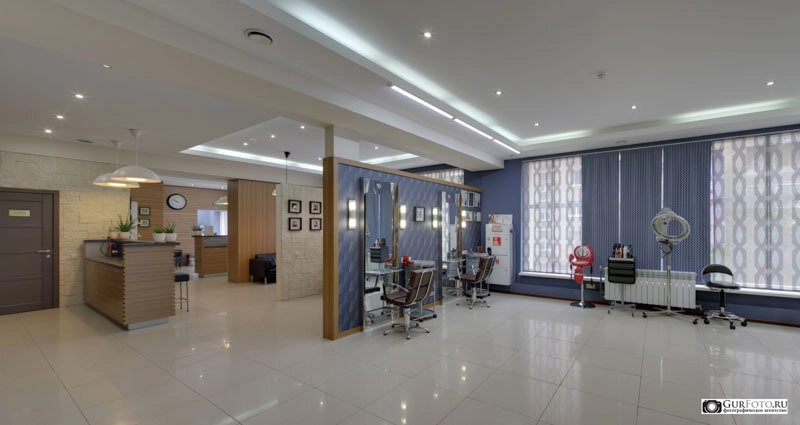

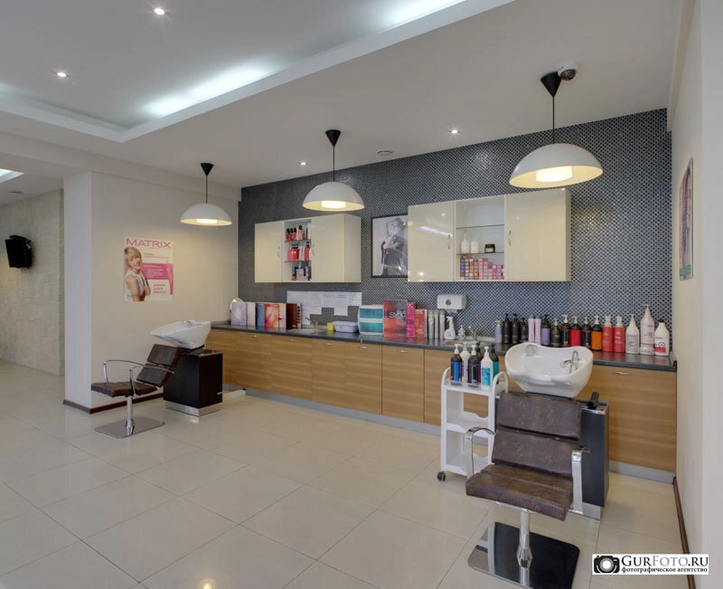

## О геометрии…

Обратите внимание на снимок ниже, угол зрения в нем приблизительно соответствует фокусному расстоянию 11-12 мм для кадра 36х24 мм, это объектив с очень широким углом и даже лучшие из таких объективов, искажают перспективу и имеют дисторсию.

Если внимательно посмотреть на снимок, то можно заметить, что секции радиатора отопления имеют разную ширину, чем дальше от центра, тем шире секции. Это представление линейной перспективы в изображении, конечно она гипертрофирована, но если она не искажает значимые элементы изображения ─ все ОК. Без признаков линейной перспективы сложно показать объем помещения.

Еще одна проблема. При использовании широкоугольной оптики, прямые, расположенные близко к границам кадра принимают форму дуг. Это явление называется «дисторсия», чем более высококачественная оптика используется для съемки, тем дисторсия меньше.

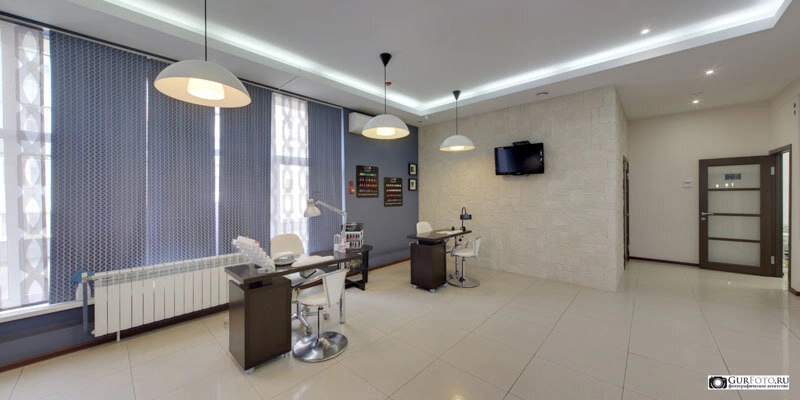

Ниже примеры, найденные в сети и демонстрирующие искажения, возникающие в том случаен, когда геометрия кадра не была исправлена. Я специально добавил в изображение вертикальные линии, чтобы ошибки стали более очевидными.
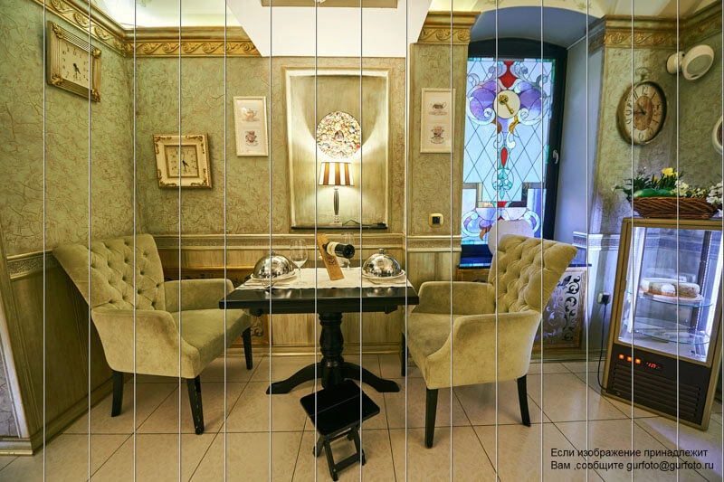

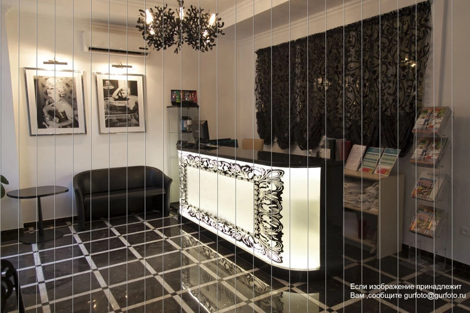

Подобные ошибки требуют исправления, если это возможно, если нет — придется снимать заново.

## Что нужно знать о компоновке кадра

Начну с того, чего быть не должно быть. Произвольные манипуляции глубиной резкости — это не признак мастерства. Странные фотографии, с непонятно как и почему определенной ГРИП (Глубина Резко Изображаемого Пространства, устоявшийся термин), распространенные объекты шуток профессиональных фотографов.

Обычно такой прием используется, чтобы скрыть детали на заднем плане и в периферических зонах кадра, которые отвлекают зрение. В подавляющем большинстве случаев, этот прием используется в художественной фотографии… предвкушая улыбки коллег, переформулирую: «не в технической фотографии».

На фотографиях интерьера не должно быть лишних объектов, особенно на переднем плане, все должно быть в фокусе, если это нет так, то этому должно быть простое и логичное объяснение. Если объяснения нет ─ нужно все переснять заново!

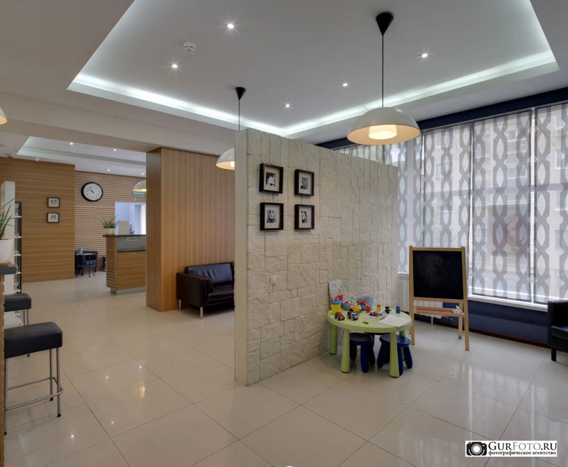

Задача фотографии выше, показать пространственную структуру некоторой части салона: три плана демонстрируют три зоны: ресепшен, lounge и детскую зону, вдоль левой границы кадра видны места для клиентов.

Ничего лишнего вроде нет, все информативно, конечно для полной картины потребуется еще 2-3 снимка. Сдвигаем камеру на несколько метров и получаем изображение рабочей зоны салона, на заднем плане виден ресепшен, что однозначно показывает связь между этой фотографией и предыдущей, это добавляет нашему знанию, так фотография за фотографией  строится представление зрителя об объекте съемки.

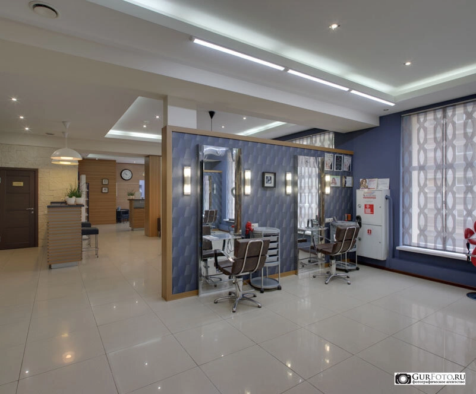

Ниже, пример того, как несколько снимков создают представление о пространстве. Одни и те же элементы и объекты, видимые в соседних кадрах, формируют представление о пространстве комнаты.

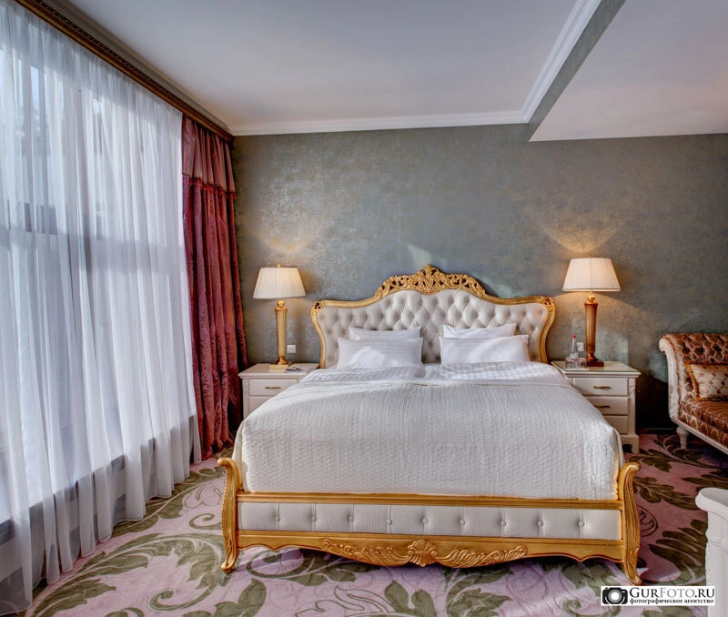

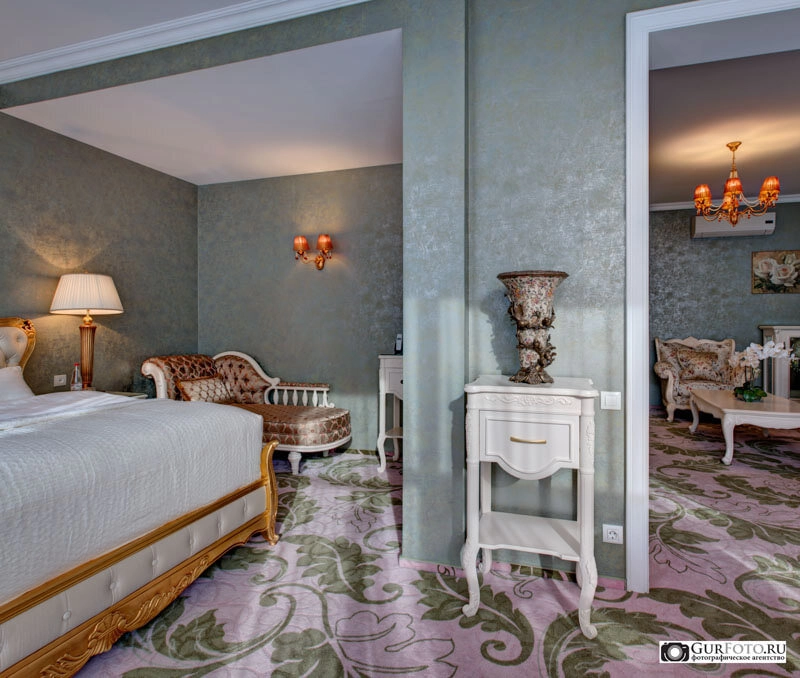

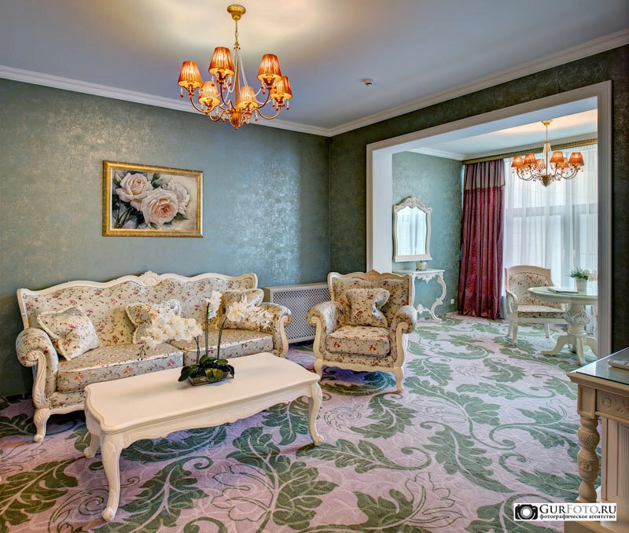

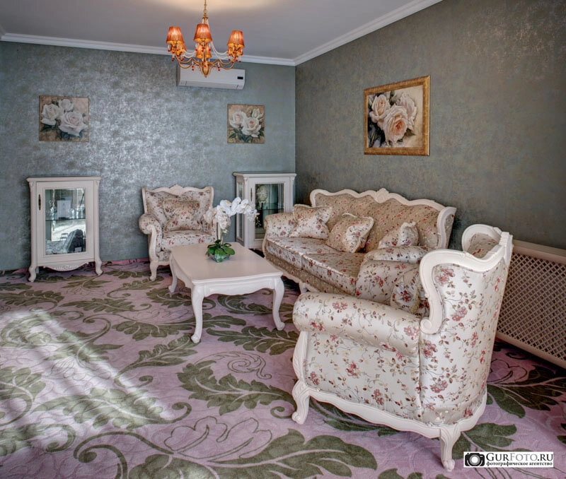

Сколько фотографий требуется для описания того или иного помещения, зависит от способности фотографа выбрать правильный ракурс, топологии помещений и некоторых других факторов.

## Свет и цвет

### Пересветы

На фотографиях иногда есть светлые и темные области, которые не содержат в себе деталей и поэтому не выглядят эстетично. Не вдаваясь в технические подробности, хочу отметить, что иногда матрица современной цифровой камеры не в состоянии зафиксировать одновременно и темные, и светлые участки сцены, поэтому требуется использования специальных приемов.

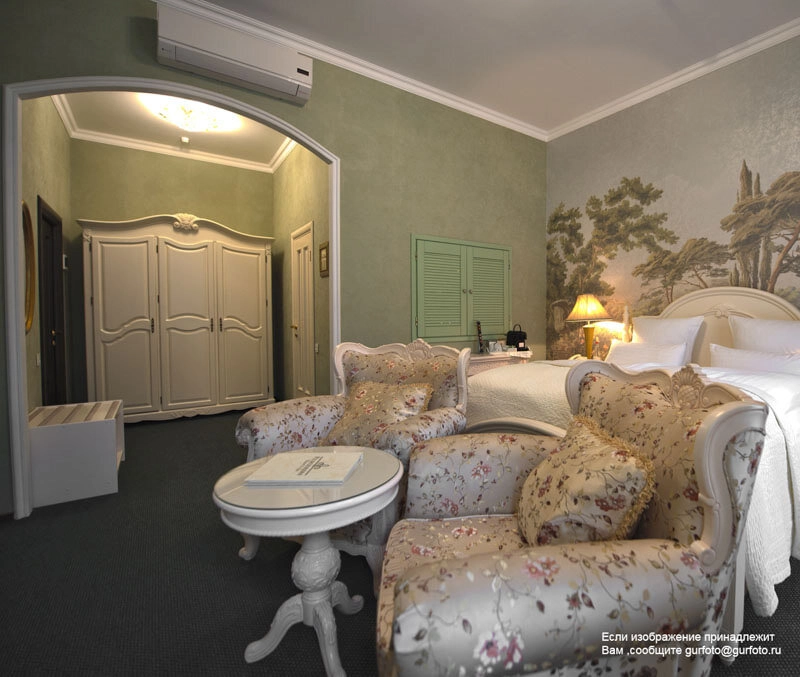

Снимок выше, обратите внимание на белое пятно, не содержащее деталей, и такое же пятно в правой части снимка — это так называемые «пересветы», брак в работе неопытного фотографа, который выглядит очень неэстетично, даже если речь идет о второстепенных деталях.

Напротив, на снимке ниже, потолочный светильник изображен со всеми деталями своей конструкции и даже светотеневой рисунок, отраженный на потолке над ним виден совершенно отчетливо, без «пересвета».

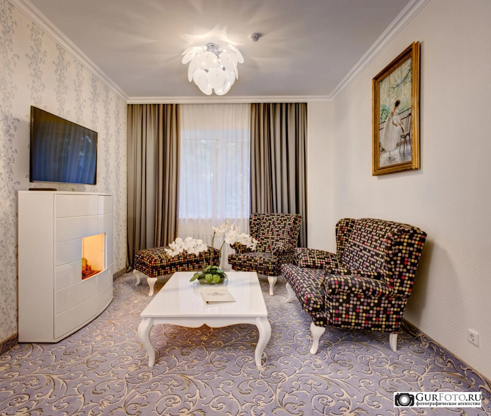

## Баланс белого цвета

Несколько слов о цвете… Человеческое зрение устроено таким образом, что попадая в помещение с цветными источниками света, через 15-20 секунд, начинает воспринимать освещение как нормальное, т.е. с правильно установленным балансом белого цвета. Фотокамера, напротив, фиксирует то что есть, в результате на снимке изображение выглядит неестественно. Разберем пример…

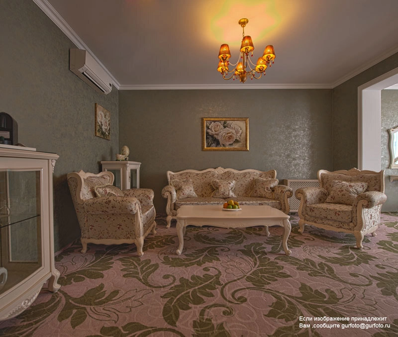

Снимок выше содержит целый букет ошибок. Неправильно определенная экспозиция, в результате чего, на потолке отчетливо видно пятно «пересвета», в то время, как в целом изображение темное — дисбаланс очевиден. Явно нарушен баланс белого цвета из-за сложного освещения, желто-зеленое пятно на потолке над люстрой.

В реальности столик, находящийся в центре кадра почти белого цвета. Я уверен, что это помещение должно выглядеть так, как оно изображено на снимке ниже.

Есть еще один момент, часто используются источники света, цвет которых на фотографии явно «выбивается» из общей цветовой картины, например желтые лампы в светильниках. Что делать в этом случае?

Я всегда советуюсь с заказчиком, потому что фотограф не в праве изменять интерьер самостоятельно, во всяком случае я так считаю.

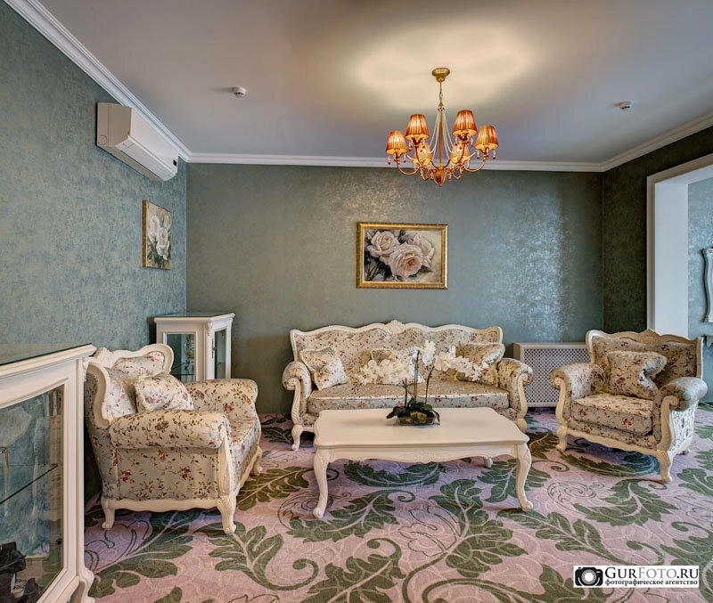

Еще одна проблема:  съемка производилась ранним утром в результате получилось так:

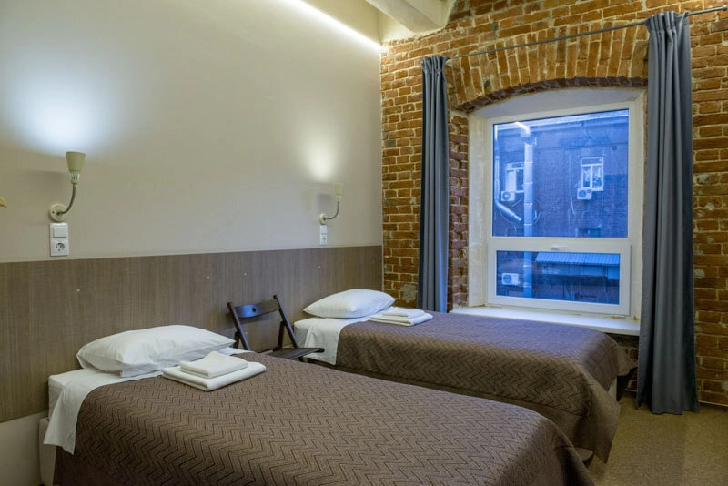

Если вы не планируете рассказывать каждому, кто увидит фотографию, историю о «ранней съемке», это нужно исправить или переснять. Предусмотреть все возможные проблемы, которые могут возникнуть в процессе съемки, невозможно, поэтому их должен предусмотреть фотограф и он же должен избежать негативных последствий.

## Динамический диапазон или как объять необъятное

Я уже писал о том, что способность цифровой камеры фиксировать одновременно детали в самых темных и самых светлых тонах, имеет ограничение, которое носит название «динамический диапазон».  Существует технология, которая позволяет существенно расширить динамический диапазон изображения путем его сжатия, это технология называется HDR (High Dynamic Range Imaging). О ней известно практически всем, кто связан с фотографией, но разумно использовать HDR умеют не все. Часто установив камеру на штатив и получив несколько кадров со смещением экспозиции, их загружают в графический редактор и нажимают кнопку «HDR»… результат часто не впечатляет: «пересветы» и непроработанные области действительно могут исчезнуть, но вместе с ними исчезает контрастность, изображение становится плоским и выглядит неестественно, смотрите пример ниже.

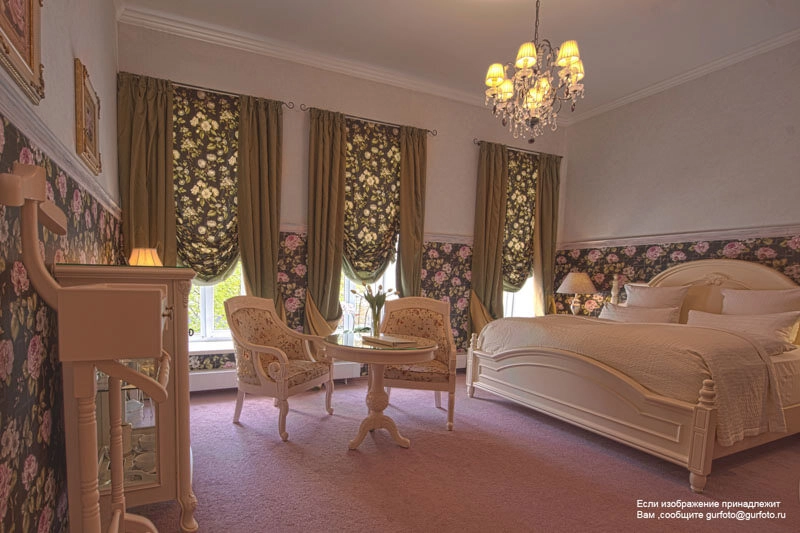

В примере, его автор почти избавился от «пересветов», видны даже детали в светлых окнах и тени под кроватью достаточно проработаны, но в целом изображение можно отправить в корзину, так как исчез контраст, искажены цвета, сильно искажена геометрия, в целом считать результат приемлемым нельзя.

На снимке ниже, довольно темное помещение, с солнечными окнами, бросающими яркие блики света на ковер, чтобы избежать «пересветов» и сохранить атмосферу помещения, пришлось сделать 5 кадров со смещением экспозиции и изрядно повозиться с файлами в графическом редакторе… зато изображение выглядит вполне естественно и, на мой взгляд, «аппетитно»…

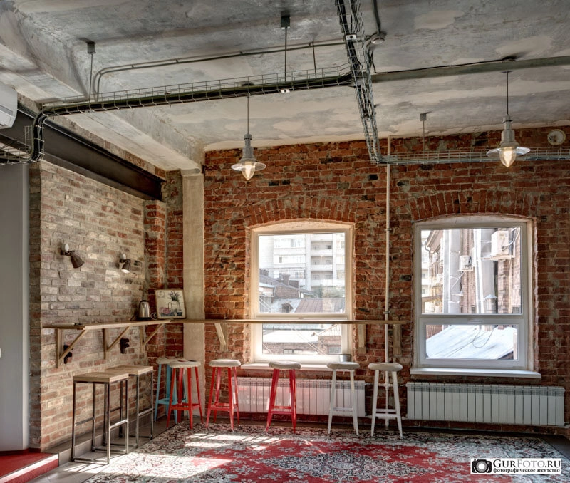

## Что в результате?

Чтобы не оказаться владельцем пакета «плохих» фотографий, нужно запомнить несколько простых правил:

- серия фотографий, которые сделал фотограф, должна легко и однозначно, без предшествующего «мозгового штурма», создавать правильное представление о геометрии помещения. При этом количество фотографий не должно быть избыточным, ведь ваши потенциальные клиенты не будут "анализировать" десять снимков, чтобы понять как выглядит жилая зона в стандартном номере отеля!
- на интерьерном снимке не должно быть «нерезкости», особенно на переднем плане.
- цвет объектов, должен соответствовать тому, как он воспринимается в реальном мире.
- изображение не должно содержать светлых и темных участков с не проработанными деталями. Светильники и пространство вокруг должны быть изображены не в виде бело-желтых пятен, а как объекты интерьера, это же касается оконных проемов.
- изображение должно быть контрастным и передавать объем.

***Попробуйте оценить фотографии интерьера, имеющиеся в вашем распоряжении и убедитесь, что пользуетесь услугами грамотного фотографа!***
