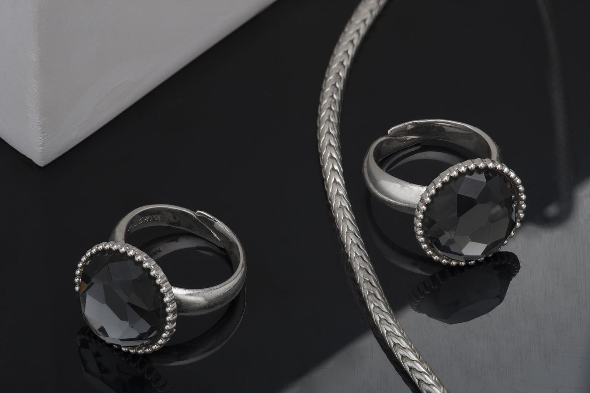
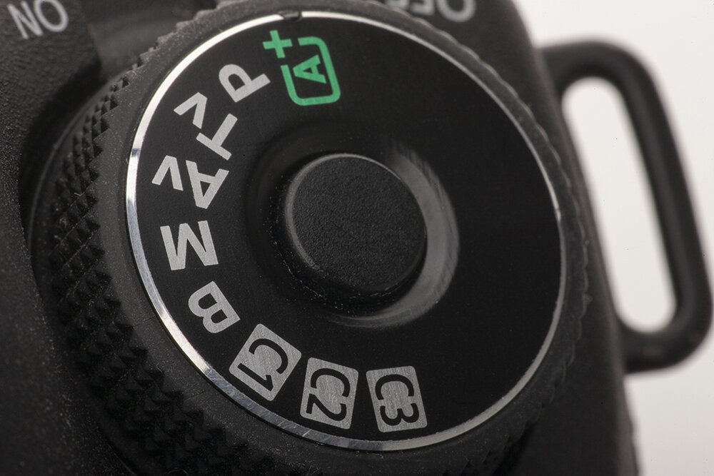
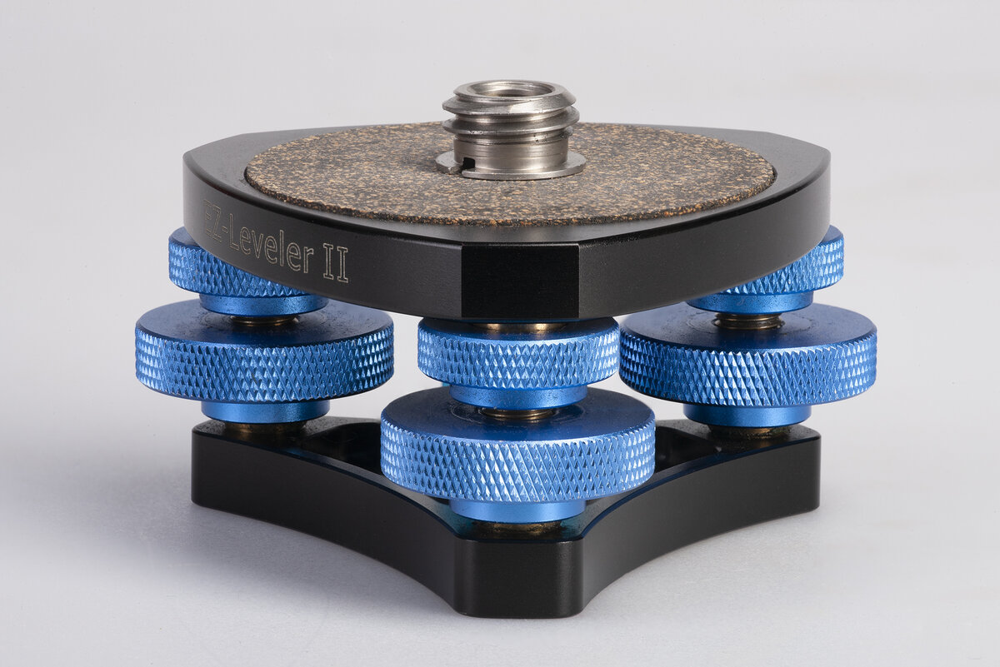
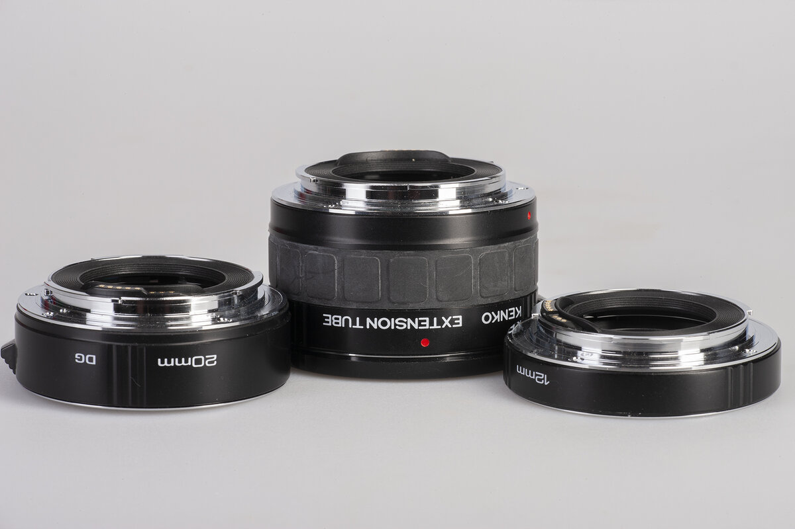
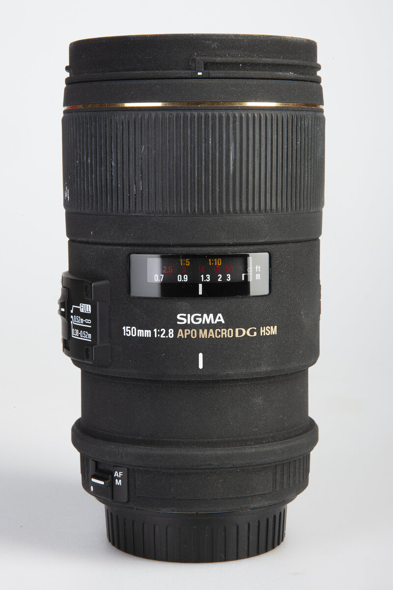

Макрофотография - это специализация в фотографии, которая предполагает съемку мелких объектов крупным планом… очень крупным планом!

Целью макросъемки является создание изображений, увеличенных сверх натуральной величины, как правило, в соотношении 1:1 или более.

Понимать это следует так, если объект имеющий размеры близкие к размерам кадра вашей камеры (для FF ─ это 36х24 мм), отображается на ней целиком в натуральном размере, значит мы говоримо макросъемке в масштабе 1:1, если размер изображения больше натуральных размеров вдвое ─ мы говорим о масштабе 2:1 и т. д.

Строго говоря, макросъемкой принято считать все, что определяется масштабом больше чем 1:5.

Для макросъемки обычно требуется специальное оборудование, такое как макрообъектив, удлинительные кольца или специальные меха, позволяющие отодвинуть объектив от поверхности матрицы.

Следует понимать, что отодвигая объектив от фокальной плоскости (поверхности матрицы), мы уменьшаем относительное значение диафрагмы кратно увеличению этого расстояния.

Для макросъемки почти всегда необходим штатив с 3D головкой. Фотографы специализирующиеся на макросъемке используют головки с точным позиционированием, это очень дорогие устройства.

Освещение также является важным фактором, поскольку макросъемка часто требует точного освещения, чтобы передать детали объекта, не отбрасывая резких теней. Поэтому применяют различные отражатели небольших размеров, позволяющие точно направлять световой поток.

Макрообъективы ─ специальные оптические устройства, разработанные для съемки крупным планом. Основными отличиями макрообъективов от обычных объективов являются минимальное расстояние фокусировки, кратность увеличения и оптическая конструкция, позволяющая получать качественные изображения на минимальных расстояниях.

У макрообъективов минимальная дистанция фокусировки намного меньше, чем у обычных объективов, что позволяет им фокусироваться на объектах с очень близкого расстояния. Это важно для съемки мелких предметов, а также для получение крупного масштаба изображения.

Оптическая конструкция макрообъективов оптимизирована для съемки крупным планом и обладает такими характеристиками, как равномерную резкость по полю кадра и низкий уровень дисторсии, которые важны для получения резких и точных изображений мелких объектов.

Обычные объективы могут не иметь такого уровня оптического дизайна, поскольку они разработаны для универсальности и широкого применения.

Практически все макрообъективы характеризуются высоким уровнем микроконтраста, поэтому в случае, когда их применяют не по назначению изображение может иметь излишнюю резкость, которая в многих случаях не приветствуется, например в портретной съемке.

Отдельно хочу обратить ваше внимание на надпись «Macro», которую часто можно увидеть на корпусах штатных зум-объективов. Это касается как очень бюджетных, так и профессиональных устройств.

Что означает такая надпись? Она декларирует, что при проектировании данного объектива, инженеры приняли в расчет интересы «макрофатографов», минимизируя минимальную дистанцию фокусировки... Это все. Получить технически качественное макроизображение профессионального уровня с помощью зум-объектива очень сложно или невозможно.

Будем рады получить ваши комментарии и вопросы.
