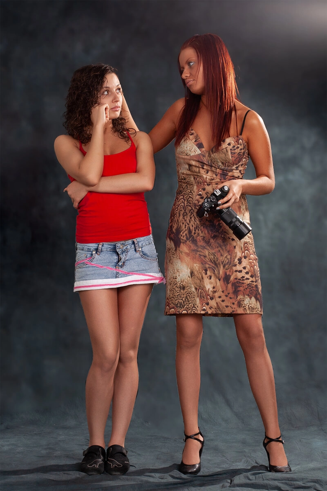

Когда в кругу фотографов речь заходит о съемках на условиях TFP, обычно наступает пауза...

Да, именно так, в фотографии "Time For Print" модели и фотографы сплетаются в танце взаимной эксплуатации, в результате модель получает стопку фотографий (в наш цифровой век ─ электронные файлы), а фотограф - горсть комплиментов, цена которых, чаще всего невелика.


Очевидным и, часто, единственным бенефициаром такой съемки становится фотостудия, аренду которой оплачивают остальные участники съемки. И если быть до конца откровенным, то чаще всего аренду оплачивает модель.
Обычно «модель» ─ девушка, которой нравится сам процесс фотографирования, она тешит себя надеждой получить фотографии приличного качества. Но об этом разговор особый, вы сами можете легко оценить его, посетив любое из сообществ, где собираются начинающие фотографы и модели.

В итоге, как правило, девушки получают то чего ожидали: пачку фотографий в виде файлов, по цене аренды фотостудии ─ что совсем недорого. На этом заканчии разговор о моделях и переходим на позицию фотографа.

С одной стороны, Фотограф совсем не обижен, он получает в пользование оборудованную студию и девушку, пребывающую в надежде.  
И для начинающего фотографа TFP — отличная возможность для практики без значительных финансовых затрат. Нужно только помнить, что еще придется преодолеть узкий пролив между Сциллой и Харибдой.

Первое из чудовищ ─ это опасность приобрести репутацию человека, готового работать бесплатно, то есть стать фотографом, чей труд ничего не стоит, по факту. Это вопрос репутации и он важен. Начинающий фотограф убеждает себя, что такое положение временное, оно существует только до тех пор, пока он не наберется опыта и мастерства, чтобы явить себя миру, хорошо, если так. Но в этом замкнутом круге прячется второе чудовище!

Вторая опасность ─ опасность попасть в колею однообразных съемок, убеждая себя в том, что это и есть творчество, что присутствует профессиональный рост, что вот-вот наступит прорыв…  
Плохая новость: находясь внутри определенной системы координат, невозможно оценить изменения, нужна связь с глобальными координатами. Нужно мнение профессионального сообщества. И это должны быть конкретные эксперты, аргументирующие свое мнение… Замкнутый круг: чтобы ваши работы критиковали, они должны быть интересны, а чтобы делать интересные работы нужны оригинальные идеи и определенный уровень мастерства.  
Доступный путь, читать статьи и книги, поднимать насмотренность, много снимать и анализировать результаты на основании прочитанного и насмотренного… TFP в помощь!

**Как только к вам выстроится очередь, переставайте работать бесплатно. Разделите проекты на коммерческие и творческие, первые делайте только за деньги! Кажется, вы увернулись от Сциллы!**

Если окажется, что желающих платитьь недостаточно или их вовсе нет, значит **"Прогнило что-то в Датском королевстве."**© Не отчаивайтесь, нужно разбираться в причинах.

Как правильно организовать свою деятельность? Давайте прочитаем ваш последний пост в паблике, где обитают девушки, желающие фотографироваться и готовые оплатить для этого аренду студии.  
Возможно кто-то не узнает этот текст, но для большинства он будет выглядеть до боли знакомым.

*«Всем привет, я фотограф.
Ищу модель для воплощения идеи, референсы прикрепляю.  
От модели: волосы средней длины, отсутствие тату, чистая кожа, стройная фигура. Отсутствие боязни камеры и опыт съемок.  
С модели оплата студии и подбор образа.
От меня все исходники и до 35 фотографий в авторской обработке.»*

Так, плюс-минус, выгляядит большинство подобных объявлений. Конкретно этот текст, компиляция множества постов из нескольких TFP-пабликов, я так сделал, чтобы никого не обидеть.  
Что можно узнать из этого объявления?  
Фотограф предлагает понять свою ИДЕЮ, глядя на прикрепленные референсы… в большинстве случаев, их изучение ни на миллиметр не приближает к пониманию этой самой ИДЕИ. Часто возникает ощущение, что фотограф не понимает значения слова «идея».  
Идея ─ это то, что можно выразить словами, например, так:  
**"История. Большой офис, в перерыв сотрудники выходят в сквер, посидеть отдохнуть, перекусить, поглазеть.  
Он, офисный человек с приличной зарплатой, неженат (варианты: разведен, в отношениях, которые перешли "в расписание" или только закончились), глядит вокруг в поиске чего-нибудь, даже не представляя чего. Одним словом, если что-то сложится ─ ОК, если нет ─ спешить некуда.  
Она, точно не замужем, возможно в отношениях, но уже давно без предложения... и уже не особенно хочется... есть желание все поменять, но не выходя из зоны комфорта, да и спешить потребности нет: все устроено: красавица и умница, признанная давно. Да, кроме того, что хороша собой, еще очень изысканна, иронична и умна, что многих отпугивает…  
ОНИ, незнакомы но переглядываются в коридорах, слегка улыбаются друг другу, допуская знакомство, но не торопят его, чтоб не вспугнуть... да и решение принимать никому не хочется. Просто приятные мысли..."**

**Что снимаем?** Снимаем тот самый обеденный перерыв: первый контакт, желание произвести впечатление с его стороны и чуть заметное одобрение с ее.
**Как снимаем?** Все деликатно, «на цыпочках». Сцен, где она дает ему пощечину или где он овладевает ею прямо на скамейке... не будет! Будет одежда, допустимая в офисе без "dress code", нужны завтраки: у нее что-то из свежих овощей, приготовленное дома и сложенное в пластиковый контейнер, у него ─ что-то купленное, fastfood, с колой.

Это, конечно, не обязательная форма представления идеи, но идея должна быть объемна, интересна и понятна. Это не набор случайных фотографий сомнительного качества, взятых из сети по запросу «красивая пара обнимается в парке».  
Часто доходит до смешного, совсем недавно в наборе референсных снимков, предложенных в качестве «идеи», среди совершенно посредственных фотографий, я заметил работу Питера Коулсона, очень известного фотографа. Не то, чтобы я так здорово знал работы этого фотографа, просто его фотография «резанула» взгляд своим уровнем на фоне соседних снимков.  
*Вывод: парень объявивший себя фотографом, особенно в фотографии не разбирается… это не фатально, если он занимается этой проблемой.*
 
Объявление выглядит так, как-будто не только оплата студии, но и вся ответственность за результат съемки лежит на модели: дефекты ретуши ─ следите за кожей, неудачные складки на теле ─ чаще посещайте фитнес, неудачные поза и мимика ─ вас же предупреждали о необходимости иметь опыт съемки и т.д. Правда непонятно, что делать с неграмотными ракурсами и кадрированием, но я уверен, что ответ найдется.  
Таким образом, смысл съемки в поиске удачи: появится красавица, с чистой кожей, навыками позирования и мэйкапа ─ фотограф в шоколаде, если, конечно, он не испортит все кадрированием и ракурсами.  
Должен разочаровать, так это не работает. Например, снимая портрет, фотограф должен раскрыть такие стороны личности, которые не очевидны пассажирам трамвая, на котором модель добирается до работы… Раскрыть неочевидные стороны личности, это и есть работа фотографа, для более простых задач есть фотобудка.

Очень важное и очень распространенное заблуждение. Вам когда-нибудь повар в ресторане выдавал очистки и обрезки или только красиво выложенное на тарелке блюдо? Зачем вы отдаете исходники, вы должны выдать клиенту только качественный готовый продукт ─ фотографии обработанные с доступным вам качеством и все, больше ничего.
Это и есть результаты вашей работы, от того, что вы отдали клиенту свои ошибки, разочарования, непонимание момента, неумение выбирать, ваша репутация может только пострадать, никаких плюсов вашему реноме здесь быть не может, только минусы.  
## Первый итог
Когда вы пишете объявление о поиске модели, которая потратит свое время и, возможно, оплатит аренду студии, мысленно разделите лист бумаги вертикальной чертой и слева напишите, что вы готовы отдать, а справа ─ что желаете получить взамен. Будьте адекватны и тогда, возможно, в качестве модели вы получите умного, творческого человека, который вместе с вами создаст что-нибудь осмысленное и интересное.
## Главный итог, он же общий вывод
Существующая практика организации фотосъемок на условиях TFP, чрезвычайно полезна для начинающих фотографов… если ее правильно использовать. Помните анекдот о любви к кошкам?  
Организуя съемку, нужно прорабатывать все моменты от костюма, мэйкапа и стиля, всего, что принято называть словом «образ», до идеи, интерьера и оборудования студии. Так вы научитесь контролировать процесс съемки на всех этапах. Помните, что все, до последней мелочи должно соответствовать идее проекта.  
Кстати, съемка начинается задолго по вашего появлении в студии. После того как вы вошли в помещение, вы берете камеру начинаете снимать то, что заранее продумано и определено.  
Прорабатывайте идею съемки до степени, когда детали очевидно вас устраивают, не стесняйтесь обратится за помощью к людям, мнение которых вы уважаете.  
Бойтесь стереотипа «война план покажет!», войдя в студию вы ничего уже не придумаете и результат, скорей всего, будет соответствующий. Готовьтесь к каждой съемке!  
Вся ответственность за результат лежит на вас, без вариантов. Апелляции к авторскому взгляду, объективным и субъективным причинам неудачи только выставляют вас в невыгодном свете.

Снимайте TFP, но помните о Сцилле и Харибде!